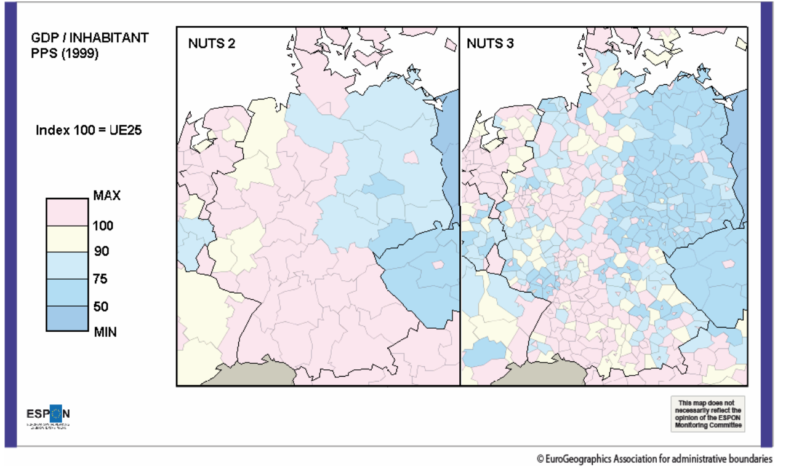

```{r setup, include=FALSE}
knitr::opts_chunk$set(echo = TRUE,fig.width =6,fig.align="center", fig.height = 3)
library(revealjs)
library(tidyverse)
library(palmerpenguins)
library(knitr)
library(xtable)
library(ggplot2)
library(dplyr)
```


## Introduction générale 

<br><br>
<br><br>
<br><br>
<small>
<div style="text-align:center;">
<span style="color:red">&#9888;</span>Pour voir les formules mathématiques, une connexion internet est requise.<span style="color:red">&#9888;</span>
</div>
</small>


## Reférences

<br>


- Cours M2 IGAST 2018 d'Ana-Maria Olteanu-Raimond 
- R et espace https://framabook.org/r-et-espace/
- Probabilités, analyse de données et statistiques , Gilbert Saporta, Editions TECHNIP, 2011
- Nombreuses ressources en ligne, e.g. : 
    - http://www.foad-mooc.auf.org/IMG/pdf/424B_-Application_des_methodes_statistiques_d_analyse.pdf
    - http://www.itse.be/statistique2010/co/Module_statistique_FSP.html


## Analyse spatiale : définition 

<br>
<br>

L’analyse spatiale étudie la **répartition** et l’**organisation** d’ensembles d’objets qui sont **localisés**  
<br>
L’objectif est de : 

<p>
*«déceler en quoi la localisation apporte un élément utile à la connaissances des objets étudiés et peut en expliquer les caractéristiques»* 
</p>
<div style="text-align:right;">
[Pumain, Saint-Julien 97] </div>


## Spécificité de l'analyse **spatiale**
<span style="text-decoration: underline;text-decoration-color: #96C31E;">Analyse statistique :</span> 

Méthodes *résumant* et *généralisant* des observations

* Les unités d’analyse sont des éléments indépendants en principe 
* On ne s’intéresse pas à leur localisation ni à leur interactions (spatiales)

<span style="text-decoration: underline;
  text-decoration-color: #96C31E;">Analyse **spatiale** statistique : </span>

  * Les unités d’analyse sont localisables 
  * On s’intéresse à leur propriétés y compris la localisation
  * On fait l’hypothèse que leur localisation peut influencer les valeurs observées


## Deux approches 
Analyse géométrique : 

approche **géométrique** pour mieux décrire les données: analyse de forme, de réseaux, de proximité, méthodes de création de nouvelles entités à partir de la géométrie des objets

<div style="border: solid #96C31E 4px; border-radius:12px; ">
<div style="margin: 10px; text-align:left;">Analyse de données  : 

approche **statistique** permettant de faire émerger des relations (des groupes, des lois)  pour aider  l’étude de certains phénomènes</div>
</div>


## Deux familles  
<br><br><br>
statistiques **inférentielles** et statistiques **descriptives** 

## Statistiques inférentielles

<br><br>

  A partir d'un échantillon , que peut-on attendre (=**inférer**) de la population ?

<br>

  - Modèles, estimateurs, ... : **régression**, **estimation**, **extrapolation**
  - e.g. sondages, rencensement 
  
## Statistiques inférentielles : exemple
  
```{r reglinexple, echo=FALSE, cache=TRUE, warning=FALSE}
library(tidyverse)
ggplot(data = penguins, 
                       aes(x = flipper_length_mm,
                           y = body_mass_g)) +
  geom_point(aes(color = species, 
                 shape = species),
             size = 3,
             alpha = 0.8) +
  #theme_minimal() +
  scale_color_manual(values = c("darkorange","purple","cyan4")) +
  labs(title = "Penguin size, Palmer Station LTER",
       subtitle = "Flipper length and body mass for Adelie, Chinstrap and Gentoo Penguins",
       x = "Flipper length (mm)",
       y = "Body mass (g)",
       color = "Penguin species",
       shape = "Penguin species") +
  theme_minimal()
```
  
  
<small>
Penguins data were collected and made available by Dr. Kristen Gorman and the Palmer Station, Antarctica LTER, a member of the Long Term Ecological Research Network.
[https://github.com/allisonhorst/palmerpenguins]
</small>


## Statistiques descriptives 
Décrire, résumer, synthétiser  les propriétés d'une **population** à partir des **variables** qui décrivent ses individus.
<br><br>
  
  - *Graphiques* : nuages de points , histogramme, ...
  - *Mesures* (fréquences, distributions, moments) sur des variables
  - *Liaisons* statistiques entre variables : **corrélation**, **covariance**
  - *Structure* interne des données : classification , ACP,...

## Dans ce module 
<br>
<br>


Nous ferons majoritairement de la statistique **descriptive**

(même si, pour bien décrire, il faut parfois inférer)


## Vocabulaire & Contexte


 
## Population
<br><br>

 **Ensemble** d'individus  
 
 "données", "corpus", "échantillon", "data"
 
<br><br>
très souvent tabulaires 
 
 
## Individus
<br><br>

 **Unité** statistique **élémentaire**: personnes, logements, ...
 
 <br><br>
  $\rightarrow$ "les lignes du tableau"


## Variables 

<br><br>

 **Caractéristiques, propriétés** d’un individu, mesurées par des enquêtes, des observations...
<br><br>
$\rightarrow$ "les colonnes du tableau"  


## Types de variables 


- **Qualitatives** : facteurs e.g. genre, CSP, type de pokemon,... 
<br>$\rightarrow$ notion de **modalité**
 
- **Quantitatives** : nombres e.g. taille, masse, revenu, surface, points de vie,...  
$\rightarrow$ parfois exprimées avec des **unités** : m, kg, s

<br>

<span style="color:red">&#9888;</span> **Valeurs** et **Nature** de données sont deux choses distinctes : 3≠trois≠III≠drei≠tres 
<br>
<br>
<span style="color:red">&#9888;</span> Valeurs manquantes  :  NA , NaN, Null 


## Analyse univariée {.flexbox .vcenter}

**Décrire**  et **mesurer** la **répartition** des valeurs que peut prendre une variable : sa  **distributions** ($\approx$ "histogramme en continu")

Parfois certaines distributions ressemblent à des distributions bien connues : on parle de **lois**


e.g. loi normale/gaussienne, loi de Poisson, géométrique, exponentielle, ...

<div class="col2">
```{r , expledistrib, cache=TRUE, fig.height=2, echo=FALSE}
xx <- data.frame(value=rnorm(8000))
plot1 <- ggplot(xx)+
        geom_density(aes(x = value), color="#aaaaaa", fill="#44DD99" )+
        theme_light()
plot1
yy <- data.frame(value=rexp(8000,rate = 4))
plot2 <- ggplot(yy)+
        geom_density(aes(x = value), color="#aaaaaa", fill="#44DD99" )+
        theme_light()
plot2
```
</div>

## Histogramme d'une variable suivant une loi normale $\mathscr{N}(0,1)$ 

```{r gaussienne1, cache=TRUE, fig.width=8, fig.height=3.5}
xx <- data.frame(value=rnorm(2600))
plot1 <- ggplot(xx)+
        geom_histogram(aes(x = value),bins = 50, color="#aaaaaa", fill="#44DD99" )+
        theme_light()
plot1
```


## Histogramme d'une distribution asymetrique à longue traîne.

```{r fat_tail1, cache=TRUE, fig.width=8, fig.height=3.5}
xx <- data.frame(value=rlnorm(2600,sdlog = 0.5))
plot1 <- ggplot(xx)+
        geom_histogram(aes(x = value),bins = 50, color="#aaaaaa", fill="#44DD99" )+
        theme_light()
plot1
```


## Difficultés de la statistique : exemple 1  


Dette 2013 = 100 milliards € 

Article de 2015 n°1 : « Diminution du déficit: La dette de la France, qui avait augmenté de 15 % l’an passé, n’a augmenté cette année que de 14%. Le gouvernement se félicite de sa gestion exemplaire.»  

Article de 2015 n°2 : « Augmentation du déficit: 15 milliard l’an passé, il dépasserait cette année 16 milliard d'euros»

Qui dit la vérité? 


## Difficultés de la statistique:  exemple 2 


Sur les mêmes chiffres du bilan d’une entreprise en 2013 et 2014

* syndicats: «tous les salaires ont baissé de 10%»
* dirigeants:  «le salaire moyen a augmenté d’environ 18%»


|               |   Ouvriers    |           Cadres   |       
|:--------------|--------------:|-------------------:|
| 2013          | effectif : 500| effectif : 100      |
|               | salaire : 1300|  salaire :2200       |
| 2014          | effectif : 200           |        effectif :  400        |
|               | salaire :1170          | salaire :        1980       |


## Précautions : Taille et représentativité de  l'échantillon

<center>

</center>


## Précautions : en présence de groupes (paradoxe de Simpsons)


<div style="text-align:center">

</div>

<small>
source: wikipedia
</small>

## Analyse univariée : plan 

Objectif : **Décrire la répartition des valeurs** d'une variable

### Mesures de **tendance centrale**

mode, moyenne, médiane

### Mesures de **dispersion**

étendue, écart-type, variance, quantiles, coefficient de variation

### Mesures de **forme**

symétrie (Skewness) et aplatissement (Kurtosis) 
 


## Données "non spatiales" 

Les variables sont des valeurs attributaires d'**individus**, leurs localisation n'est pas prise en compte

## Données spatiales
  
  Individus restreints spatialement (**selection spatiale**), ou variables de **localisation** géographique (e.g. Lieu de résidence, coordonnées) renseignées pour les individus 
  
  
  
  quid des **distances** ? $\rightarrow$ modèle gravitaire , réseau etc.


## \ 

#### variables quantitatives **continues** : $var \in \mathbb{R}$

Valeurs réelles,  toutes les valeurs de l'intervalle de mesures peuvent exister 
<br><br>

#### variables quantitatives **discrètes**  : $var \in \mathbb{N}$ 

Valeurs entières, pour des attributs **dénombrables** (comptage) , 

parfois utilisées pour encoder une variable qualitative à deux modalités e.g. présence (1) , absence(0)


## Variables **qualitatives**

les valeurs sont prises dans un ensemble **fini** de valeurs possibles, défini par **extension** (i.e. on donne la liste des valeurs possibles)


$\rightarrow$ notion de **modalités** 

## \ 

#### variables qualitatives **nominales**

Les modalités ne sont **pas ordonnées** explicitement 

e.g. situation matrimoniale $\in$ {marié·e, célibataire, veuf·ve}

#### variables qualitatives **ordinales**

Les modalités sont **ordonnées** selon un ordre **total** et non-ambigu. 

e.g. Echelle de Likert (5 ou 7 valeurs, dont une neutre)

satisfaction $\in$ {Très satisfait, Satisfait, Ni satisfait ni insatisfait, Peu satisfait, Pas du tout satisfait}


## l'Échelle d’Analyse


Spécificité de la statistique spatiale : à quelle échelle observer ? 

Quel découpage, quelles unités spatiales ?

«Problème insoluble» : le **MAUP** (Modifiable Areal Unit Problem)

##  Unités spatiales agrégées 

agrégation d’unités spatiales : comtés, départements, régions, pays

e.g. Comprendre comment  le taux de chômage d’un pays est distribué entre les régions pour guider les politiques économiques

## Groupe d’unités spatiales: 

identification des unités spatiales ayant des caractéristiques semblables

e.g. IRIS


## Échelle individuelle vs. Échelle agrégée 

**Désagrégation** ou  **Ventilation** 
<br>
  $\rightarrow$ Inférer des caractéristiques individuelles à partir de l’analyse de données agrégées

<br>
**Agrégation** 
<br>
  $\rightarrow$ Inférer des caractéristiques concernant les unités agrégées d’après les caractéristiques individuelles 
<br><br>
<span style="color:red">&#9888;</span>pas toujours possible et pas immédiat !<span style="color:red">&#9888;</span>

## le MAUP (Modifibale Aereal Unit Problem)

Problème d'agrégation spatiale : les résultats d'une analyse statistique spatiale dépendent du choix d'agragation 

biais «sytématique et insoluble» 

Exemples tirés du rapport ESPON : 

[https://www.espon.eu/sites/default/files/attachments/espon343_maup_final_version2_nov_2006.pdf](https://www.espon.eu/sites/default/files/attachments/espon343_maup_final_version2_nov_2006.pdf)


## MAUP exemple 1


<div style="text-align:center">

</div>

## MAUP exemple 2

<div style="text-align:center">

</div>


## Statistique descriptive univariée : la tendance
<br><br><br>
Moyenne(s), mode , médiane 


## Moyenne

$\displaystyle \bar{x} = \frac{1}{n}\sum_{i=0}^{n} x_i$


## Moyenne pondérée

Lors que les valeurs n'ont pas le même poids <br>
<br>
par exemple poids = effectif de la valeur dans la population.
<br>

$\displaystyle \bar{x} = \frac{1}{\sum_{i=0}^n pi}\sum_{i=0}^{n} p_i x_i$


## Avantages et inconvénients de la moyenne

### Avantage
  Chaque valeur compte

### Inconvénients 

* sensibilité aux valeurs extrèmes 
* pas de signification sur les valeurs discrètes (e.g. 2.5 enfants par femme)


$\rightarrow$ exclure les outliers<br>
$\rightarrow$ utiliser un autre estimateur<br>
$\rightarrow$ étudier la distribution des valeurs (e.g. cas bimodal) et opérer une classification


## Autres Moyennes


## Moyenne geométrique:
<br>

$\displaystyle \bar{x} = \sqrt[n]{\prod _{i=0}^{n} x_i}$  

Moins sensible à la présence de valeurs extrèmes

## Moyenne quadratique (RMS) 
<br>

$\displaystyle \bar{x} = \sqrt{\frac{1}{n}\sum _{i=0}^{n} x_i^2}$


## Cas particulier : Moyenne glissante

Moyenne calculée sur une fenètre de $n$ valeurs consécutives.

e.g. on reçoit une mesure chaque seconde, très bruitée, et on désire afficher 10 minutes de signal lissé dans le temps

 $\rightarrow$ on calcule pour chaque point du signal, la moyenne sur 10 valeurs consécutives (5 en avant , 5 en arrière)


## le Mode {.flexbox .vcenter}

**Mode** :  valeur la plus fréquente (effectif max.) de la série de valeurs que prend une variable.
<br>
<br>
<span style="color:red">&#9888;</span> si variable quantitative continue : faire une classification .
Dans ce cas, le mode est la moyenne des valeurs min et max des bornes de la classe de plus grand effectif.

## Avantages et inconvénients du mode

### Avantages 
Peu sensible aux valeurs extrêmes (moins sensible que la moyenne)

Signification concrète : la situation la plus fréquente

### Inconvénients 
Ne dépends pas de toutes les observations : la modification d'une seule valeur n’entraîne pas une modification du mode

## la Médiane 

**Médiane** : valeur qui partage une série de valeurs en d**eux sous-ensembles d’égal effectif**

Comme en géométrie, la médiane est la valeur de la variable qui est la plus proche de toutes les autres.

## Etapes de calcul 
Ordonner les valeurs selon un ordre croissant

Calculer le rang $i=\frac{n+1}{2}$

si $n$ impair, la valeur médiane existe dans la série statistique

si $n$ pair, la valeur médiane est entre deux valeurs et est égale à la moyenne de ces deux valeurs


## Avantages et inconvénients de la médiane 

### Avantages 
Plus pertinente que la moyenne

Peu sensible aux valeurs extrêmes 

A une signification concrète : divise en deux la distribution : un individu sur deux a une valeur inférieure ou supérieure à celle-ci

### Inconvénient 
Ne dépend pas de toutes les observations : la modification d'une seule valeur n’entraine pas une modification de la médiane 


## Quelle mesure choisir ?

Tout dépend de la distribution ! 

$\rightarrow$ **Toujours** afficher l'histogramme ou la distribution de densité
<br><br>

Le **mode** est privilégié pour les valeurs **nominales** et si on désire considérer «le cas le plus fréquent»

Distribution sans longue traîne ? <br>
$\rightarrow$ moyenne et médiane

Plusieurs modes dans la distribution ?<br>
$\rightarrow$ classification puis mediane / moyenne par classe


## Distribution bimodale 

```{r bimod1, cache=TRUE, echo=FALSE,fig.width=8, fig.height=3.5}
xx <- data.frame(value=rnorm(1600,mean = 5, sd = 1))
yy <- data.frame(value= rnorm(1400, mean = 10, sd=2) )
xx <-  rbind(xx, yy)
plot1 <- ggplot(xx)+
        geom_line(aes(x = value),stat = "density", color="#44DD99", lwd= 1.3)+
        geom_vline(xintercept = mean(xx$value), color="red")+
        geom_vline(xintercept = median(xx$value),color="blue")+
        annotate("text", x=c(8,5.5), y=c(0.2,0.2), colour=c("red","blue"),label=c("mean", "median"))+
        theme_light()
plot1
```

Que choisir : moyenne ou médiane ? 


## Distribution unimodale symétrique 

```{r gaussienne2, cache=TRUE, fig.width=8, fig.height=3.5}
xx <- data.frame(value=rnorm(2900,mean = 5, sd = 1))
plot1 <- ggplot(xx)+
        geom_line(aes(x = value),stat = "density", color="#44DD99", lwd= 1.3)+
        geom_vline(xintercept = mean(xx$value), color="red")+
        geom_vline(xintercept = median(xx$value) + 0.02,color="blue")+
        annotate("text", x=c(4.5,5.5), y=c(0.2,0.2), colour=c("red","blue"),label=c("mean", "median"))+
        theme_light()
plot1
```


## Histogramme et distribution en R


la fonction `hist` affiche un histogramme d'un vecteur **numerique**:

```{r histoR}
x <-  rnorm(2500) #init
hist(x)
```

## Histogramme et distribution en R

un histogramme n'a pas de sens  pour une variable **qualitative**. 

On peut utiliser `barplot`,<span style="color:red; font-size:1;">&#9888;</span> mais ce n'est plus une distribution ! 

```{r histoR2,fig.width=8 }
x <-  sample(month.name, 2500, replace=T)
tx <- table(x)
barplot(tx , las=2)
```


## Statistique descriptive univariée : la dispersion

## La dispersion statistique 

Tendance des valeurs d'une variable à se disperser autour des valeurs des tendances centrales.

Exemple :  deux variables X et Y, $\sim\mathscr{N}(0,1)$

```{r gaussienne2D, cache=TRUE}
mydataset <- data.frame(X=rnorm(900), Y=rnorm(900))
plot1 <- ggplot(mydataset)+
        geom_point(aes(x = X, y=Y), fill="#44DD99", color="#666666", shape=21)+
        coord_equal()+theme_light()
plot1
```


## Variance et Écart-type

La **variance** est la somme des écarts carrés à la moyenne

$\displaystyle var_X= \frac{1}{n}\sum_{i=1}^{n}(x_i -\bar{x})^2$

Avec :
  
  * $X$ une variable
  * $x_i$ les valeurs de la variables
  * $\bar{x}$ la moyenne de $X$ 
  * $n$ l'effectif

$\sigma_X = \sqrt{var_X}$  : l'**écart type** est la racine carrée de la variance

## Variance et Écart-type

Variance et écart-type rendent compte de la **dispersion** de la variable autour de sa moyenne.

Ils sont **sensibles** aux valeurs extrèmes et toujours **positifs**.

Si $var_X = 0$ ou $\sigma_X = 0$ , alors $X$ est **constante**.

Un écart-type faible indique que les valeurs sont réparties de façon **homogène** autour de la moyenne.

## Précaution {.flexbox .vcenter}

<span style="color:red; font-size:1.5em;">&#9888;</span>Variance et écart type n'ont d'intérêt que pour qualifier des distributions **unimodales**, et (à peu près) **symétriques**


(i.e. proche de la Gaussienne)


## Lorsque $X\sim \mathscr{N}(\mu,\sigma)$

```{r stddev1, cache=TRUE, echo=FALSE}
library(latex2exp)
X <- data.frame(value=rnorm(1900))
plot1 <- ggplot(X)+
        geom_line(aes(x = value),stat="density", color="#44DD99", lwd=1.2)+
        geom_vline(xintercept = c(-sd(X$value), sd(X$value)), color="red")+
        geom_vline(xintercept = c(-2*sd(X$value), 2*sd(X$value)), color="blue")+
        annotate("text", x=c(1.5,2.5), y=c(0.3,0.12), colour=c("red","blue"),label=c("68,27% de l'effectif ", "95,45% de l'effectif "))+
        theme_light()
plot1
```


<br>
$[-\sigma;\sigma] \approx \frac{2}{3}$  de l'effectif
<br>
<br>
$[-2\sigma;2\sigma] \approx$ 95% de l'effectif

## Quantiles

La **médiane** sépare une population en **deux** classes d'égal effectif selon la valeur d'une variable (quantitative).

Les **quantiles**  séparent une population en **$n$** classes d'égal effectif 

Les **quartiles** d'une population selon une variable $X$ sont trois valeurs, $Q_1,Q_2,Q_3$ qui séparent la population en **quatre** classes d'égal effectif.
<small>

  * 25% des valeurs de $X$ sont strictement inférieures à $Q_1$
  * 50% des valeurs de $X$ sont strictement inférieures à $Q_2$ (médiane)
  * 75% des valeurs de $X$ sont strictement inférieures à $Q_3$
  
</small>

## Déciles

Les déciles sont les **9** quantiles $Q_1,Q_2,\dots,Q_9$ qui séparent une population  selon la valeur d'une variable quantitative en **10** classes d'égal effectif.

## Ecarts inter-quartiles et inter-déciles

Deux mesures de la **dispersion** d'une distribution : 

<br><br>
**Écart inter-quartile**: $Q_3-Q_1$ , capture 50% des valeurs de la population les plus proches de la médiane

<br><br>
**Écart inter-déciile**: $Q_9-Q_1$ , capture 80% des valeurs de la population les plus proches de la médiane

## Les boîtes à moustaches (boxplots)

représentation courante de la dispersion d'une variable à l'aide de **quartiles**


```{r boxplot1, cache=TRUE}
plot1 <- ggplot(iris)+
  geom_boxplot(aes(y=Sepal.Width,x= Species) ) + coord_flip()
plot1
```


## Avantages et inconvénient des quantiles

### Avantages

Peu sensibles aux distributions aplaties et aux valeurs extrèmes

L'écart inter-quantile est plus robuste que l'écart-type

### Inconvénients

Parfois délicat pour les variables quantitatives discrètes

Les écarts inter-quantiles négligent l'influence des valeurs extrèmes sur la distribution

## Le coefficient de variation 

Le **coefficient de variation** ($CV$) est une autre mesure de dispersion.

C'est le ratio entre l'écart-type $\sigma_x$ et la moyenne $\bar{x}$ d'une variable quantitative $X$.

$\displaystyle CV(X)=\frac{\sigma_x}{\bar{x}}$

Plus il est important , plus la dispersion est grande.

Plus il est proche de 0, plus les données sont homogènes.


Il souffre des mêmes inconvénients que la moyenne et l'écart-type : sensibilité aux valeurs extrèmes.

## Comparaison de dispersion de deux distributions de valeurs.


Exemple : deux communes  versent des aides aux entreprises locales. 

Commune A :  moyenne = 390 euros, $\sigma$ = 30 euros 

Commune B :  moyenne = 152 euros, $\sigma$ = 8 euros

Pour quelle commune les aides sont les plus homogènes?

<br><br>
<small>On pourrait aussi comparer des distribution de valeurs exprimées dans des unités différentes !</small>

## **(Mauvaise)** Comparaison visuelle de deux distributions

<span style="font-size:60%; margin-top:-50px">Pour échantilloner dans une loi normale : fonction `rnorm`</span>

```{r compDistNorm1, fig.height=2.8}
A <-  rnorm(n = 10000, mean = 390, sd = 30)
B <-  rnorm(n = 10000, mean = 152, sd = 8)
par(mfrow=c(1, 2)) #2 graphes en colonnes
hist(A, probability = T)
lines(density(A), col="red")
hist(B, probability = T)
lines(density(B), col="red")
```
Qu'est ce qui ne va pas ?


##  Comparaison visuelle de dispersion de deux distributions


Il faut une **échelle commune** !

```{r compDistNorm2}
A <-  rnorm(n = 10000, mean = 390, sd = 30)
B <-  rnorm(n = 10000, mean = 152, sd = 8)
par(mfrow=c(1, 2))
hist(A, probability = T, xlim = c(50,600), ylim = c(0,0.05))
lines(density(A), col="red")
hist(B, probability = T,xlim = c(50,600), ylim = c(0,0.05))
lines(density(B), col="red")
```


## Statistique descriptive univariée : la forme
  
## **Asymétrie** des distributions.


```{r asym1, echo=FALSE, fig.width=8, fig.height=4, cache=TRUE}

xx <- seq(-5,5, length.out = 100)
normale <-  dnorm(xx,mean = 0, sd=1)
xxx <- seq(0,10, length.out = 100)
droite <-  dgamma(xxx,2,1)

droiteValues <-  rgamma(1000,2,1)
droiteValues <-  rgamma(1000,2,1)

xxxx <-seq(10,0, length.out = 100) 
gauche <- dgamma(xxxx, 2,1)
mydata <- data.frame(value=xx, dens=normale, type="Normale", moy=0, med=0, mod=0)
droitedata <- data.frame(value=xxx, dens=droite, type="Asymétrique positive", moy=mean(droiteValues), med=median(droiteValues), mod = 1)
gauchedata <- data.frame(value=xxx, dens=gauche, type="Asymétrique négative", moy=10-mean(droiteValues), med=10-median(droiteValues), mod=9)

gauchedata <- rbind( gauchedata, mydata)
gauchedata <- rbind(gauchedata, droitedata)

ggplot(gauchedata, aes(x=value, y=dens))+geom_line(color="#44DD99", lwd=1.2)+
  geom_vline(aes(xintercept = moy), col="red")+
  geom_vline(aes(xintercept = med), col="blue")+
  geom_vline(aes(xintercept = mod), col="orange")+
  facet_grid(cols=vars(type), scales="free")+
  ylab(label = "density")+
  theme_light()+
  annotate("text", x=3.5, y=0.4, colour=c("red"),label="moyennne")+
  annotate("text", x=3.5, y=0.37, colour=c("blue"),label="médiane")+
annotate("text", x=3.5, y=0.34, colour=c("orange"),label="mode")
```


## les Coefficients de Pearson
<br><br>

Deux moyens simples d'estimer l'asymétrie 
<br><br>
$\displaystyle C_1 = \frac{\bar{x} - mode(X)}{\sigma_x}$
<br><br>
$\displaystyle C_2 = \frac{3(\bar{x} - mediane(X))}{\sigma_x}$

## Interprétation des coefficients d'asymétrie
<br><br>

  * si le coefficient **nul**, la distribution est **symétrique**
  * si le coefficient est **négatif**, la distribution est **déformée à gauche** de la médiane (sur-représentation de valeurs faibles, à gauche)
  * si le coefficient est **positif**, la distribution est **déformée à droite** de la médiane (sur-représentation de valeurs fortes, à droite)

## Le coefficient de Fischer
<br><br>

Ce coefficient est le moment  d'ordre 3  de la variable $X$ ( de moyenne $\mu$ et d'écart-type $\sigma$) **centrée réduite**

$\displaystyle skewness'=\mathbb{E}\bigg[\bigg(\frac{X-\mu}{\sigma}\bigg)^3\bigg]=\frac{\sum_{i=0}^{n} (x_i - \bar{x})^3}{n\sigma^3}$


## L'aplatissement des distributions (kurtosis)


```{r kurtos1, echo=FALSE, fig.width=10, fig.height=2, cache=TRUE}

normaleC <- 1 
picC <- 0.6
plateC <- 3


xx <- seq(-5,5, length.out = 100)
normale <-  dnorm(xx,mean = 0, sd=normaleC)
pic <-  dnorm(xx, mean = , sd=picC)
plate <- dnorm(xx, mean=, sd=plateC)

mydata <- data.frame(value=xx, dens=normale, type="Normale")
piquee <- data.frame(value=xx, dens=pic, type="Leptokurtique")
applatie <-  data.frame(value=xx, dens=plate, type="Platokurtique")


mydata <- rbind(mydata, piquee)
mydata <- rbind(mydata, applatie)

ggplot(mydata, aes(x=value, y=dens))+geom_line(color="#44DD99", lwd=1.2)+
  facet_grid(cols=vars(type), scales="free")+
  ylab(label = "density")+
  theme_light()
```

Courbe piquée: Peu de variation, distribution relativement homogène, beaucoup de valeurs égales ou proches de la moyenne.

Courbe applatie: Variations importantes, distribution relativement hétérogène, beaucoup de valeurs s'éloignent de la moyenne.


## Coefficient d'applatissement : kurtosis 

Coefficient non normalisé :


$\displaystyle K=\frac{\sum_{i=1}^{n}(x_i -\bar{x})^4}{n\sigma^4}$

Si la distribution est normale , $K= 3$

Si $K>3$, la distribution est **plus applatie** 

Si $K<3$, la distribution est **moins applatie** 

On normalise parfois en considérant $K'=K-3$ (excès d'applatissement)


## Transformations des données 

## Variables centrées-réduites 

<span style="color:red">&#9888;</span> En principe, uniquement lorsque la distribution d'une variable est proche d'une gaussienne <span style="color:red">&#9888;</span> 


Centrer : soustraire la moyenne

Réduire : diviser par l'écart-type


une variable **centrée réduite** est exprimée en «écarts-types à la moyenne»

$\rightarrow$ permet de repérer les valeurs extrèmes (<2 ou >2)

$\rightarrow$ utile pour comparer des individus selon un grand nombre de variables (tableaux de synthèse)

## Fat-tail distributions


Les distributions très asymétriques et très étendues sont délicates à résumer.

Les indicateurs traditionnels sont plus efficaces lorsque la variabilité des valeurs est moindre, et leur distribution plus symétrique.

e.g. Considérer la population moyenne des villes de France a-t'elle du sens ? 
```{r histoVillesPop, cache=TRUE, echo=FALSE, fig.width=8, fig.height=2.5}
mydata <-  read.csv("pop_communes.csv")
plot_PopVilles <- ggplot(mydata)+
  geom_histogram(aes(x=Population.totale), bins=60 , color="#aaaaaa",fill="#44DD99" )+
  geom_vline(xintercept = mean(mydata$Population.totale), color = "red")+
  annotate("text", x=15000, y=400, colour=c("red"),label="moyennne = 7517.37 ")+
  theme_light()
plot_PopVilles
```


## Distribution rang-taille des villes de france 


Pour mieux voir la distribution et les écarts, on trace la **taille** des villes en fonction de leur **rang** 

```{r popVilles1 , cache = TRUE, fig.width=8, fig.height=4, echo=FALSE}
mydata <-  read.csv("pop_communes.csv")
plot_PopVilles <- ggplot(mydata)+
  geom_point(aes(x=rank(-Population.totale), y=Population.totale), color="#44DD99")+
  xlab(label = "rang")+ylab("Population")+ggtitle("Distribution rang-taille des villes de France")+
  theme_light()
plot_PopVilles
```

## Transformation logarithmique

Appliquer une transformation **monotone**, **bijective** et **inversible** qui "applatisse" la distribution.

  * réduit les écarts entre les valeurs
  * resserre  l'essentiel des valeurs 

$\implies$ mesure de façon plus robuste  tendance, dispersion et forme

Ici : le logarithme décimal


## Bonus : distribution rang-log(taille) 

```{r loglin1 , cache = TRUE, fig.width=8, fig.height=4, echo=FALSE}
mydata <-  read.csv("pop_communes.csv")
plot_PopVilles <- ggplot(mydata)+
  geom_point(aes(x=rank(-Population.totale), y=Population.totale), color="#44DD99")+
  xlab(label = "rang")+ylab("Population")+ggtitle("Distribution rang-taille des villes de France")+
  scale_y_log10()+
  theme_light()
plot_PopVilles
```


