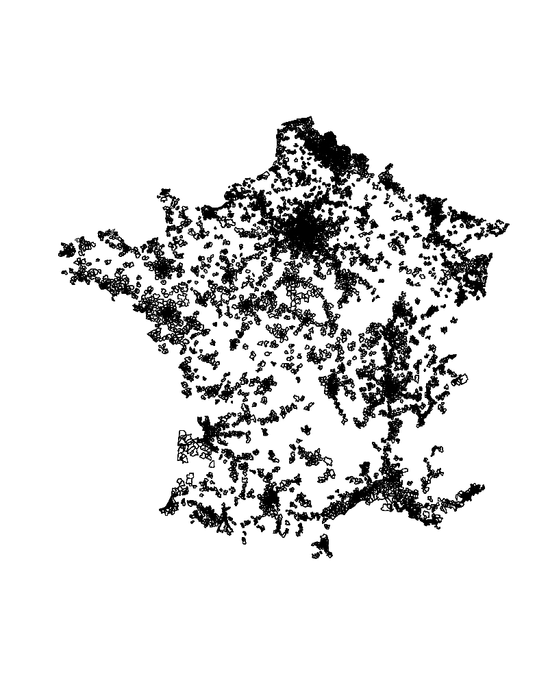

```{r setup, include=FALSE}
knitr::opts_chunk$set(echo = TRUE)
library(sf) #charge le package
library(tidyverse) #charge le package
```


**Objectif principal** : Fournir une base de code qui utilise les packages `sf` (manipulation d'objets geographiques), `ggplot` (graphiques)  et `dplyr` (manipulation de données au sens large)  pour charger, afficher et requèter des objets spatiaux.

**Objectif secondaire** :  Donner un aperçu des capacités SIG de R 


# Prérequis 

- Connaissance minimale de R et des SIG 
- installation des pacakges `sf` et `tidyverse` (contient `dplyr`, `ggplot2` et beaucoup d'autres choses)

```{r inst_pckg, eval=FALSE}
install.packages("sf")
install.packages("tidyverse")
```


## Le combo `sf` et `dplyr` 

Très rapidement : le package `sf` manipule  les objets géographiques comme des dataframes augmentés d'une colonne de géométrie. Cette colonne géométrie "suit" les individus (les lignes) du dataframe lors des manipulations. C'est très pratique pour les opérations ( combinaisons, agrégations, filtrages, ...)   opérés  sur les **attributs** des objets , comme on le verra plus tard.

le package `tidyverse` qui contient `dplyr` défini de nombreux opérateurs récurrents dans la manipulation de données : filtrage , arrangement , agrégations, groupements. Il est "compatible" avec `sf` , et la combinasion des deux est d'une grande flexibilité.

## Les limites de l'exercice 

R ne permet pas de manipulation interactive à la souris. Tout se fait de façon programmatique en définissant les traitements dans un script.


# Les données 

Données ouvertes de consommation de gaz à l'IRIS disponibles sur [https://www.data.gouv.fr/fr/datasets/consommation-annuelle-de-gaz-par-iris-2010-a-2017/#_] Nous ne ferons pas beaucoup d'interprétation thématiques le but étant d'avoir un jeu de données d'une taille assez importante pour jouer avec. 


## Chargement des données


Le dataset est lourd : 725 Mo. Nous allons le charger une seule fois, puis nous ferons une selection des données de façon à ne travailler que sur un échantillon.


```{r load1, cache=TRUE}
library(sf) #charge le package
library(tidyverse) #charge le package
df <-  st_read("./consommation-annuelle-gaz-agregee-maille-iris.geojson")
```

La fonction `st_read()` lit les données du fichier dont on donne le chemin d'accès, et sélectionne le driver approprié en fonction du fichier (shp, geojson, etc.)


Pour connaître le nom des attributs de la couche vecteur on utilise la fonction `names`. La fonction `head` affiche (par défaut) les 6 première lignes d'un dataframe. 


```{r load2, cache=TRUE}
names(df)
head(df)
```


On constate d'emblée que certains codes IRIS sont non attribués (NA). On va commencer par filtrer le dataframe pour ne garder que les lignes dont le code IRIS est attribué . 

### Filtrage des données : Valeurs NA

La fonction `filter` du package `dplyr` permet de filtrer un dataframe selon un critère défini par une **condition** (booléenne), comme dans un `if()` .

Nous allons utiliser la fonction `is.na` qui renvoie comme son nom l'indique TRUE si une valeur est NA , FALSE sinon.

Exemple d'utilisation : 

```{r isNA, cache=TRUE}
x <-  NA
is.na(x)
y <- 12
is.na(y)

```


On utilise cette fonction dans la condition de la fonction `filter` :

```{r removeNA, cache=TRUE}
df_filtered <-  df %>% filter(!is.na(code_iris))
cat(nrow(df) - nrow(df_filtered), " lignes retirées") 
rm(df)
```

On a filtré ainsi plusieurs lignes dans ce dataset.
On supprime l'objet `df` de la mémoire pour économiser la RAM avec la fonction `rm()` : inutile de garder une copie d'un objet aussi lourd en mémoire.


## Filtrage des données : Année 2013

On réitère le filtrage avec l'attribut `annee` : 

```{r year2017 , cache=TRUE}
df_filtered <-  df_filtered %>%  filter(annee==2013)
nrow(df_filtered)
```


Au passage nous avons vu: 

- la fonction `is.na()` qui teste si une valeur est NA.
- l'opératuer de négation `!` booléen
- La fonction `nrow()`retourne le nombre de ligne d'un tableau.
- La fonction `cat()` affiche la version "imprimable" d'une séquence d'objets, séparés par des virgules. 
- la fonction `rm`qui suprrime un objet de la mémoire.
- `dplyr` permet d'écrire les traitements en chaînes, au moyen de l'opérateur ` %>% ` , qui se lit **pipe** (en anglais hein, cf l'opérateur UNIX | ), et qui lie les objets aux fonctions. Nous reviendrons sur cette syntaxe plus tard.
- remarquez la concision de l'opération de filtrage, qui tient en une seule ligne. 


Autre fonction utile : `anyNA()` qui teste la présence de valeurs NA dans tout un ensemble : dataframe , colonne, ligne , collection, etc..
Nous nous en servons pour vérifier que la colonne `code_iris` ne contient plus de valeurs NA. 

```{r anyNA, cache=TRUE}
anyNA(df_filtered$code_iris)
```


En revanche, le dataframe dans son ensemble contient encore des valeurs NA, dans d'autres colonnes : 
```{r anyNA2, cache=TRUE}
anyNA(df_filtered)
```


## Selection d'un sous ensemble de données 

### Premier affichage 

Nous pouvons afficher la géométrie de nos données, mais étant donné le grand nombre d'entités (~200k), et la finesse des mailles IRIS, ce sera **long** et guère lisible. ça risque aussi de faire planter la session R , qui n'aime pas qu'on lui demande d'afficher des milliers d'objets dans une sessions graphique. 

Si vous avez pas mal de RAM ( quelques Go) et que vous décidez d'afficher quand même l'objet, cela se fait (au bout d'un long moment) en éxécutant la ligne suivante : 

```{r plot1, cache=TRUE, eval=FALSE}
plot(st_geometry(df_filtered))
```


Vous obtiendrez quelque chose comme ça : 

<center>
{height=70%}
</center>


### Sélection d'une région

Nous allons sélectionner une région et constituer le sous ensemble des IRIS de cette région.

On commence par lister les valeurs des régions dans le dataframe. Le nom des régions est inscrit dans la colonne `nom_region` : 

```{r region, cache=TRUE}
unique(df_filtered$nom_region)
```

La fonction `unique()` retire les doublons d'une collection. C'est l'équivalent d'un `SELECT DISTINCT` en SQL. 

On autrait pu écrire la même chose avec la syntaxe des pipes de `dplyr` : 
    
```{r region2, cache=TRUE, evgal=FALSE}
df_filtered$nom_region %>%  unique()
```

Qui peut se lire ainsi : «la colonne `nom_region` du dataframe `df_filtered` est envoyée à la fonction `unique()`» 

On voit aussi que certaines régions sont en double et que les niveaux régionaux varient: les noms sont à la fois inscrits en majuscules et en minuscules, et certaines sous-régions sont présentes.

On va choisir une région (celle que vous voulez), moi je prends la région **Grand Est** (Lorraine, Alsace, Champagne-Ardennes). 
Les objets qui m'intéressent sont donc ceux dont l'attribut `nom_region` vaut : 

- GRAND EST, ou
- Grand Est, ou
- LORRAINE, ou 
- ALSACE, ou 
- CHAMPAGNE-ARDENNE


Pour sélectionner les données du Grand Est , il nous faut une condition de filtrage. 
 On va utiliser l'opérateur ensembliste `%in%` qui teste si un élément appartient à un ensemble de valeurs

Voici un exemple d'utilisation :
```{r infunc, cache=TRUE}
"donald"  %in% c("riri", "fifi", "loulou")
8  %in% c(2,4,6,8,10,12)
3.14 %in% c("PI", 3.14, "pi")
```

Au passage on note la fonction `c()` qui permet de créer des vecteurs par **extension** (i.e. en donnant les valeurs)


<br>

Dans notre cas pour ne conserver que les IRIS dont l'attribut `nom_region`  appartient aux valeurs qui nous intéressent, le traitement s'écrit : 

```{r regionGE, cache=TRUE, evgal=FALSE}
df_GE <-  df_filtered %>% filter(nom_region %in% c("GRAND EST", "Grand Est", "LORRAINE",
                                                   "ALSACE","CHAMPAGNE-ARDENNE" ))
nrow(df_GE)
rm(df_filtered)
```

le dataframe `df_GE` contient ~16k entités spatiales, ce qui est plus raisonnable pour commencer à afficher les objets. On va également retirer les géométries vides , à l'aide de `filter` et du prédicat `st_is_empty` qui teste si des géométries sont vide dans le dataset.

```{r filterEmptyGeom, cache=TRUE, evgal=FALSE}
df_GE <-  df_GE %>%  filter(!st_is_empty(geometry))
nrow(df_GE)
```


### Carte choroplète d'un facteur 

Voyons rapidement comment afficher les géométries colorées par un attribut avec la fonction `plot` , redéfinie par le package `sf`. Cette fonction prend en argument soit une géométrie, soit un attribut  d'un objet `sf`, mais **sans** l'opérateur `$` , uniquement avec l'opérateur `[]` et le nom de l'attribut entre quotes. 


```{r plotsf1, cache=TRUE, eval=FALSE}
plot(st_geometry(df_GE))

```


```{r plotsf2, cache=TRUE, eval=FALSE}
df_GE$nom_region <- droplevels(df_GE$nom_region) 
plot(df_GE["nom_region"], lwd = 0.2, key.width = lcm(6))
```


 
Pour comprendre les arguments supplémentaires de la fonction `plot()`  pour l'épaisseur des arêtes des polygones et la taille de la légende , reportez-vous à la documentation.
 


 À noter : l'attribut `nom_region` est de  type `factor`. (Pour connaître le type d'un attribut , utilisez la fonction `class()`).  R conserve les **valeurs que peuvent prendre  les facteurs **  (les modalités en français, en R ils sont  appelés  des `levels` ) . Ici nous avons un sous-ensemble du dataframe complet, dont l'attribut  `nom_region` appartient à 5 modalités : "GRAND EST", "Grand Est", "LORRAINE",  "ALSACE","CHAMPAGNE-ARDENNE" : nous l'avons filtré dans ce but. 

Mais lorsqu'on observe les modalités de l'attribut `nom_region`, on constate qu'il a toujours 41 modalités : 

```{r levels, cache=TRUE}
levels(df_GE$nom_region)
```
 
Or, lorsqu'on cherche à afficher l'attribut de type `factor` d'un objet spatial,  R et `sf` utilisent toutes les modalités pour tracer le cartouche de légende pour les couleurs. Pour éviter d'avoir un cartouche avec 41 valeurs de couleurs, nous avons redéfini  les modalités de l'attributs `nom_region` en ne conservant que les modalités présentes dans notre sous-ensemble, par la fonction `droplevels()`, dont on se sert pour reaffecter l'attribut `nom_region` du dataframe `df_GE`.     
 
 
## Système de coordonnées de référence

Pour connaître le CRS d'un objet spatial, s'il est défini, on utilise la fonction `st_crs()` :

```{r crs_ss, cache=TRUE}
st_crs(df_GE)
```


<br>
Pour reprojeter l'objet, on utilise la fonction `st_transform()` avec en argument le code EPSG du CRS désiré.
Ici , on définit un Lambert-93 (code EPSG 2154)  et on reaffecte le produit de la transformation au dataframe  lui-même : 

```{r crs_ss2, cache=TRUE}
df_GE <- st_transform(df_GE, 2154)
st_crs(df_GE)
```

On constate que l'attribut CRS de l'objet spatial a bien été changé. 


# Cartographie directe d'un attribut 

## Carte choroplète d'un facteur avec `ggplot`

Voici comment obtenir une carte choroplète de l'attribut `nom_epci` avec `ggplot2` 


```{r ggplot1, cache=TRUE}
p1 <-  ggplot(df_GE)+
  geom_sf(aes(fill=nom_region), size=0.1, alpha=0.2)+
  scale_fill_discrete()+
  theme_void()
p1
``` 

La syntaxe de ggplot est assez particulière , reportez-vous à l'excellent site du MTES et sa formation à R , notamment le chapitre 5 qui parle de ggplot2 pour un panorama plus complet:
[https://mtes-mct.github.io/parcours-r/m5/index.html]


## Carte choroplète d'un facteur avec `ggplot`  (bis)


Visiblement l'attribut `nom_region` est assez peu informatif et mal renseigné : tout est dans la région Grand Est, on va plutôt cartographier les IRIS en les colorant par départements.

Pour obtenir les départements , on examine les attributs du dataframe. Les deux premiers chiffres du  code IRIS correspondent au numéro de département. 
Pour le récupérer, on convertit l'attribut `code_iris` en chaîne de caractère (avec la fonction`as.character()`), 
puis on coupe cette chaîne de caractères pour ne garder  que les 2 premiers caractères, avec la fonction `substr()`.
On stocke le résultat de cette chaîne de traitement  (notez à nouveau l'utilisation du pipe ` %>% ` pour enchaîner les traitements) dans un nouvel attribut : `code_departement` 


```{r carto_code_reg, cache = TRUE}
df_GE$code_departement <-  df_GE$code_iris %>%  as.character() %>%  substr(1,2)
p3 <-  ggplot()+
  geom_sf(data=df_GE ,aes(fill=code_departement), size=0.1)+
  scale_fill_discrete(name = "Valeur brute de \n l'attribut code_departement ") +
  theme_void()
p3

```

Cela produit une carte un peu plus utile, même si ce n'est pas le but de ce tutoriel. 

## Sous-ensembles des IRIS de Meuse

Nous allons encore réduire la taille de notre échantillon pour ne garder que les IRIS du département de la Meuse.
Le code de département de la Meuse est le 55.
Nous filtre le dataframe du Grand-Est pour ne conserver que les IRIS dont l'attribut `code_departement` vaut 55. (Notez que l'attribut `code_departement` est de type `character`, d'où le test d'égalité avec la valeur `"55"`. )

```{r IRIS55, cache=TRUE}
df_55 <-   df_GE %>%  filter(code_departement== "55")
p4 <-  ggplot()+
  geom_sf(data=df_55 , size=0.1)+
  labs(title = "Les IRIS de Meuse")+
  theme_void()
p4
```

## Carte à symbole proportionnels d'une quantité

Comme vous le savez, on ne représente pas une variable de stock par un aplat de couleur, la carte choroplèthe est donc exclue.
Nous allons créer des cercles proportionnels à une quantité (l'attribut `total_données_consommations` ), que nous allons superposer aux polygônes  des IRIS.

### centroïdes des IRIS 

Nous allons localiser les cercles proportionnels sur les centroïdes des polygônes des IRIS.
Pour créer les centroïdes , on utilise la fonction `st_centroid()`
Cette fonction ne fonctionne pas si des polygonjs sont vides, ce qui est le cas de quelques polygon du dataframe `df_55`.
On les enlèves par filtrage en utilisant le prédicat `st_is_empty()` , ce qui a déjà été fait plus haut , lors du traitement du dataframe `df_GE` , mais je le remets ici.


```{r centroides, cache=TRUE}
df_55 <-  df_55 %>%  filter(!st_is_empty(geometry)) 
centroides <-  st_centroid(df_55)
plot(st_geometry(df_55), border="orange")
plot(st_geometry(centroides), add=T, pch=4, cex= 0.1)
```

La carte obtenue nous montre qu'il va être délicat de faire "tenir" de grands symboles pour les petits IRIS... 
Essayons quand même, avec un attribut  numérique de quantité:  `residentiel_nombre_de_pdl` : 


```{r cartoCircProp, cache=TRUE}
plot(st_geometry(df_55), border="orange")
plot(st_geometry(centroides), add=T, pch=20, cex= df_55$residentiel_nombre_de_pdl * 0.001)
```

Il nous faut trouver le bon facteur de taille à appliquer à l'attribut `cex` de la fonction `plot`. ggplot devrait mieux s'en sortir , au prix d'un argument difficilement explicable  : `sf_coordinates ` 

```{r cartoCircProp2, cache=TRUE}
p4 <-  ggplot()+
  geom_sf(data=df_55 , size=0.1)+
  geom_point(data=centroides, aes(size=residentiel_nombre_de_pdl, fill=residentiel_nombre_de_pdl, geometry=geometry ), stat = "sf_coordinates")+
  labs(title = "Les IRIS de Meuse")+
  theme_void()
p4
```


# Manipulations des géométries

la liste complètes des opérateurs "purement"" géométriques de `sf` est disponibles ici :
[https://r-spatial.github.io/sf/articles/sf3.html#geometrical-operations-1]


## Jointure spatiale

## Union de géométries


# Manipulations basées sur les attributs


